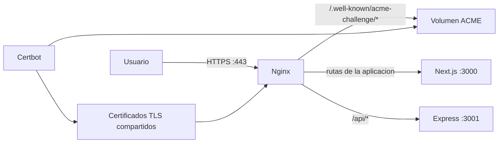

# Despliegue de SEAL con Next.js, Nginx, Docker y HTTPS

## Objetivo

Desplegar SEAL en un servidor Linux con una sola direccion publica y sin exponer directamente Next.js ni Express. Nginx recibe las conexiones HTTP/HTTPS, termina TLS y funciona como proxy inverso. Certbot obtiene y renueva el certificado gratuito de Let's Encrypt.



Next.js recomienda colocar un proxy inverso como Nginx delante del servidor al autoalojar una aplicacion. El proxy se encarga de TLS, limites de carga y trafico potencialmente malformado. La opcion `output: "standalone"` produce los archivos minimos necesarios para una imagen Docker de produccion.

## Archivos incorporados

- `compose.yaml`: coordina frontend, backend, Nginx y Certbot.
- `Front/Dockerfile`: compila Next.js y ejecuta su salida standalone como usuario sin privilegios.
- `Back/Dockerfile`: ejecuta Express e instala Chromium para las funciones PDF de SEAL.
- `deploy/nginx/default.conf.template`: proxy, redireccion HTTP a HTTPS y configuracion TLS.
- `deploy/init-letsencrypt.sh`: arranque inicial y solicitud del certificado.
- `.env.example`: dominio, correo y seleccion del entorno de Let's Encrypt.

La URL publica del API es `https://DOMINIO/api`. Nginx elimina el prefijo `/api` antes de enviar la peticion al backend, porque las rutas actuales de Express comienzan en `/auth`, `/admin`, `/client`, etc. Los puertos 3000 y 3001 solo existen dentro de la red de Docker.

## Requisitos previos

1. Un servidor Linux con IP publica y Docker Engine con el complemento Docker Compose.
2. Un dominio o subdominio, por ejemplo `seal.midominio.com`.
3. Un registro DNS `A` que apunte el dominio a la IPv4 del servidor. Si se publica un registro `AAAA`, tambien debe apuntar correctamente a su IPv6.
4. Los puertos TCP 80 y 443 abiertos en el firewall del proveedor y del sistema operativo.
5. El archivo de credenciales Firebase en `Back/secrets/firebase-admin.json`, o la ruta equivalente configurada en `Back/.env`.

El desafio HTTP-01 de Let's Encrypt necesita que el dominio llegue al servidor por el puerto 80. Nginx deja accesible `/.well-known/acme-challenge/` y redirige el resto del trafico HTTP a HTTPS.

## Demostracion local gratuita

Para una actividad academica no es necesario contratar un VPS ni comprar un dominio. `compose.local.yaml` levanta la misma arquitectura en Docker y Nginx instala un certificado de desarrollo generado con mkcert. Este certificado solo se usa para desarrollo; no sustituye a Let's Encrypt en un sitio publico.

En macOS:

```bash
brew install mkcert
chmod +x deploy/generate-local-cert.sh
./deploy/generate-local-cert.sh
docker compose -f compose.local.yaml up -d --build
```

La aplicacion queda disponible en:

```text
https://localhost
```

Puede verificarse con:

```bash
docker compose -f compose.local.yaml ps
curl -I https://localhost
curl https://localhost/api/health
```

Para abrirla desde un movil conectado a la misma red Wi-Fi, primero se obtiene la IP de la Mac y se incluye en el certificado:

```bash
IP_LOCAL=$(ipconfig getifaddr en0)
./deploy/generate-local-cert.sh "$IP_LOCAL"
LOCAL_HOST="$IP_LOCAL" docker compose -f compose.local.yaml up -d --build
```

En el movil se abre `https://IP_LOCAL`. El equipo movil mostrara una advertencia hasta que se instale y confie la CA local `rootCA.pem` indicada por `mkcert -CAROOT`. Para una exposicion basta con demostrar el candado valido en la computadora; instalar una CA de desarrollo en el movil es opcional. Nunca debe compartirse `rootCA-key.pem`.

## Configuracion del servidor

Desde la raiz del repositorio:

```bash
cp .env.example .env
cp Back/.env.example Back/.env
```

Editar `.env`:

```dotenv
DOMAIN=seal.midominio.com
CERTBOT_EMAIL=administrador@midominio.com
CERTBOT_STAGING=1
```

Editar `Back/.env` y reemplazar, como minimo, estos valores:

```dotenv
JWT_SECRET=una-cadena-aleatoria-larga
TOKEN_PEPPER=otra-cadena-aleatoria-larga
FIREBASE_SERVICE_ACCOUNT=secrets/firebase-admin.json
GEMINI_API_KEY=clave-real
ADMIN_BOOTSTRAP_PASSWORD=una-contrasena-segura
```

Tambien deben configurarse SMTP y Firebase Storage cuando esas funciones se usen. Nunca se deben subir `.env`, certificados ni la cuenta de servicio al repositorio.

## Primera emision del certificado

Dar permiso y ejecutar el inicializador:

```bash
chmod +x deploy/init-letsencrypt.sh
./deploy/init-letsencrypt.sh
```

Conviene hacer primero una ejecucion con `CERTBOT_STAGING=1`; ese certificado es de prueba y el navegador no confiara en el. Esto permite detectar errores de DNS o firewall sin consumir los limites de emision. Una vez validado el proceso:

```bash
docker compose down
sudo mv certbot/conf "/tmp/seal-certbot-staging-$(date +%s)"
```

Cambiar `CERTBOT_STAGING=0` en `.env` y volver a ejecutar `./deploy/init-letsencrypt.sh` para obtener el certificado real.

## Verificacion

```bash
docker compose ps
curl -I http://seal.midominio.com
curl -I https://seal.midominio.com
curl https://seal.midominio.com/api/health
```

El primer comando HTTP debe responder con una redireccion `301` a HTTPS. El endpoint de salud debe responder `{"ok":true}`. Para inspeccionar fallos:

```bash
docker compose logs --tail=100 nginx
docker compose logs --tail=100 frontend
docker compose logs --tail=100 backend
docker compose logs --tail=100 certbot
```

## Renovacion y operacion

El contenedor Certbot intenta renovar los certificados cada 12 horas; Certbot solo renueva cuando se acerca su vencimiento. Nginx recarga los certificados cada 6 horas. Puede probarse el proceso sin emitir nada con:

```bash
docker compose run --rm --entrypoint certbot certbot renew --dry-run
```

Comandos cotidianos:

```bash
# Reconstruir tras actualizar el codigo
docker compose up -d --build

# Ver el estado
docker compose ps

# Detener la aplicacion conservando certificados y archivos
docker compose down
```

El volumen `backend_storage` conserva los archivos locales generados por SEAL. Los certificados permanecen en `certbot/conf` del servidor.

## Revision de seguridad antes de produccion

Durante la validacion se ejecutó `npm audit --omit=dev`. El archivo de dependencias actual reporta 2 paquetes vulnerables en el frontend y 27 en el backend, incluidos avisos de severidad alta o critica. Esto no impide demostrar la arquitectura de Nginx y TLS, pero si debe atenderse antes de un despliegue con datos reales. Se recomienda actualizar las dependencias directas y transitivas en una tarea separada, ejecutar nuevamente las pruebas funcionales y evitar `npm audit fix --force` sin revisar sus cambios incompatibles.

## Fundamentacion tecnica

- [Guia oficial de autoalojamiento de Next.js](https://nextjs.org/docs/app/guides/self-hosting): recomienda un proxy inverso delante de Next.js.
- [Opciones oficiales de despliegue de Next.js](https://nextjs.org/docs/app/getting-started/deploying): documenta Docker y la salida standalone.
- [Modulo de proxy de Nginx](https://nginx.org/en/docs/http/ngx_http_proxy_module.html): define `proxy_pass` y los encabezados reenviados al servicio interno.
- [Tipos de desafios de Let's Encrypt](https://letsencrypt.org/docs/challenge-types/): explica HTTP-01 y su uso obligatorio del puerto 80.
- [Documentacion de Certbot](https://eff-certbot.readthedocs.io/en/stable/using.html): explica los modos webroot y renovacion.

## Conclusion

La solucion separa responsabilidades: Next.js renderiza la interfaz, Express resuelve el API, Nginx es el unico punto expuesto y Certbot administra TLS. De esta forma SEAL funciona bajo un mismo origen HTTPS, reduce la superficie expuesta y cuenta con renovacion automatica del certificado.
